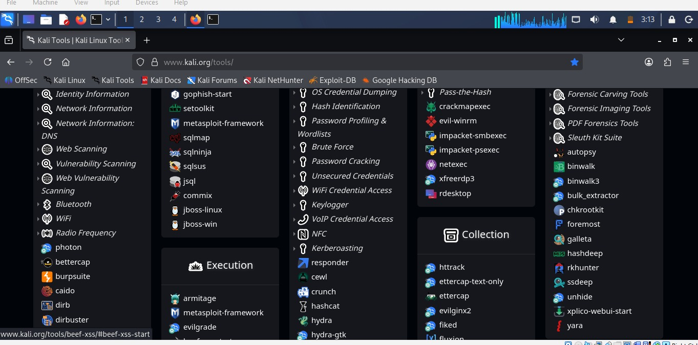
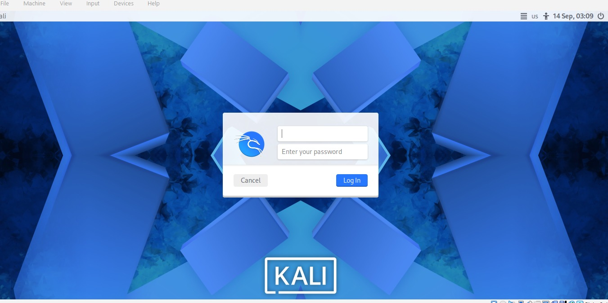

# Week 2 PM1 - Cybersecurity & Ethical Hacking Learning Environment

## Overview

This repository documents my hands-on cybersecurity and ethical hacking learning environment as part of Week 2 Practical Milestone 1 (PM1). It includes practical work related to virtualization, Kali Linux setup, networking fundamentals, reconnaissance, and security testing in an isolated lab environment.

**Purpose:** Develop practical cybersecurity skills in an isolated, authorized environment.

---

## Lab Objectives

- Build an isolated cybersecurity practice environment
- Configure virtual machines for security testing
- Install and configure Kali Linux
- Configure virtual networking (NAT/Host-Only)
- Understand IP addressing and connectivity
- Practice reconnaissance and enumeration
- Perform vulnerability assessment in authorized labs
- Create snapshots for safe experimentation and rollback

---

## Lab Environment & Specifications

### Virtualization

| Component | Details |
|-----------|---------|
| Hypervisor | Oracle VirtualBox |
| Host OS | Windows |
| Security Testing OS | Kali Linux |
| Network Type | NAT / Host-Only Network |
| Purpose | Isolated cybersecurity laboratory |

### Tools Installed


- Nmap
- Wireshark
- Burp Suite
- Metasploit Framework
- Gobuster
- Netcat
- Python

### Network Configuration

.jpg

| Machine | Example IP |
|---------|------------|
| Kali Linux | 10.0.0.6 (Current Lab IP) |
| Target VM | 10.0.0.10 |
| Test VM | 10.0.0.11 |

> **Note:** These addresses are examples for an isolated lab environment only.

---

## Phase 1 — Kali Linux Setup

### Step 1: Install VirtualBox

Oracle VirtualBox was installed and configured as the virtualization platform for the cybersecurity laboratory.

### Step 2: Install Kali Linux

Kali Linux was installed inside a virtual machine and configured for security testing and cybersecurity practice.

.jpg)



### Step 3: Configure Network Connection

The virtual machine network adapter was configured using an isolated laboratory network.

### Step 4: Verify Network Configuration

Network configuration was verified using standard Linux networking commands:

```bash
ip addr
